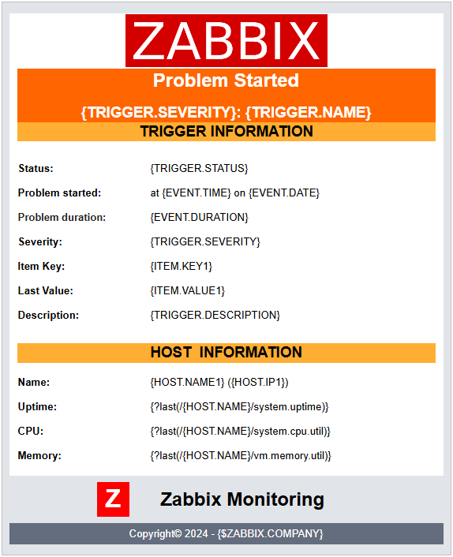
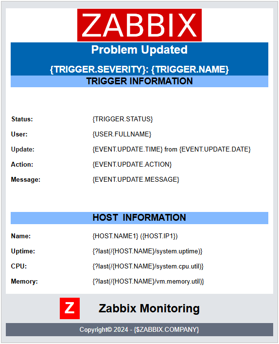

# zabbix-html-email-templates
Zabbix HTML Email Template

This repository contains a set of customizable HTML templates for use with a Zabbix media type that support it.

 

## Requirements

- [Zabbix DB with UTF-8 encoding](https://www.zabbix.com/documentation/current/en/manual/appendix/install/db_scripts)
- [Zabbix Media Type](https://www.zabbix.com/documentation/current/en/manual/config/notifications/media) cofigured with the `HTML` message format
- Define a `{$ZABBIX.URL}` **global macro** for message links that point to the alerted event.
  > _The URL should be either an IP address, a fully qualified domain name or localhost. See [MS Teams integration](https://www.zabbix.com/integrations/msteams) for examples._
- Also define a `{$ZABBIX.COMPANY}` **global macro** so that you company name, or other name of your choosing, gets put into the message.

 

## Customization

You can customize many tags. From the logo, trigger/host information, colors, footer, etc.

> [!NOTE]
> Some media types have limited support for markup languages, such as Telegram. It is advisable to experiment and customize the message to fit your scenario. \
> One possible limitation is the database encoding as [not all emojis are encoded correctly](https://www.zabbix.com/forum/zabbix-cookbook/413606-coloured-html-email-notification-templates) by the database.

> [!TIP]
> - **For emojis, it is recommended to use the entity codes. [EmojiGuide](https://emojiguide.org) can help finding the correct codes.**
> - **You can easily test the HTML code with tools such as [↗️ W3 School HTML editor](https://www.w3schools.com/tryit/tryit.asp?filename=tryhtml_hello)**

 

## Installation
> **Copy the template and adjust it to suit your scenario. Then paste it into your media configuration.** \
> ↗️ [Zabbix Media Type configuration](https://www.zabbix.com/documentation/current/en/manual/config/notifications/media)

 

⏺️ [HTML Templates](./templates/)

 

## Samples

### [HTML 01](./templates/html-01/)
|  |  | 
| :---: | :---: | :---: |
 

### [HTML 02](./templates/html-02/)
|  |  | 
| :---: | :---: | :---: |
 

### [HTML 03](./templates/html-03/)
|  |  | 
| :---: | :---: | :---: |
 
